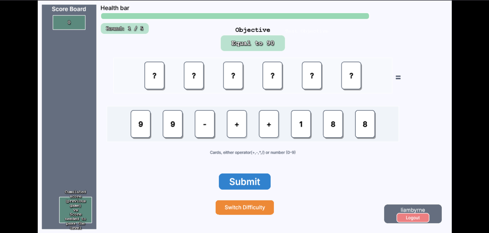

# Mathatro

**A Math Education Card Game**

Mathatro provides an educational and entertaining way for students to learn math through interactive card-based gameplay. By combining numbers and operators, students become more familiar with mathematical concepts while having fun!

## About the Project

The game uses a deck of playing cards with numbers and mathematical operators. To progress, players must combine these cards to meet the objective of each round — for example, ">17" or "<9". The aim is to complete all rounds while maintaining health and achieving the highest score possible.

There are multiple difficulty tiers - Easy, Medium, and Hard. Each offers unique increases in both challenge and engagement. Difficulty affects the range of possible objective solution numbers, the types of mathematical operators provided on cards, and the number of rounds per game.



Whether you're a math whiz or someone who finds math challenging, you're bound to have some fun!

<sub>By Team SOFTGEN 310 Group 99.75</sub>  
<sub>This project is associated with the University of Auckland – SOFTENG 310</sub>

---

## Table of Contents

- [Mathatro](#mathatro)
  - [About the Project](#about-the-project)
  - [Table of Contents](#table-of-contents)
  - [Key Features](#key-features)
  - [Built With](#built-with)
  - [Getting Started](#getting-started)
    - [Prerequisites](#prerequisites)
    - [Installation](#installation)
    - [Firebase Setup](#firebase-setup)
  - [Testing](#testing)
    - [Running Tests](#running-tests)
    - [Adding New Tests](#adding-new-tests)
  - [Contributing](#contributing)
  - [Project Structure](#project-structure)
  - [Versions and Releases](#versions-and-releases)
    - [Release History](#release-history)
    - [Development Milestones](#development-milestones)
  - [License](#license)

---

## Key Features

- **User Authentication** - Secure login and profile management powered by Firebase
- **Randomly Generated Objectives** - Each round presents unique mathematical challenges
- **Solvability Guarantee** - Smart algorithm ensures all objectives are always completable
- **Health System** - Health bar depletes on incorrect answers, encouraging accuracy
- **Multiple Difficulty Tiers** - Easy, Medium, and Hard modes for all skill levels
- **In-Game Instructions** - Clear guidance for new players
- **Modern UI Design** - Clean, intuitive interface with professional color palette and Inter font
- **Comprehensive Testing** - Extensive test coverage for reliability
- **Clear Documentation** - Well-documented codebase and contributor processes
- **Code Quality & Security** - Integrated SonarCloud and Snyk for continuous monitoring

## Built With

- **[Phaser 3.80.1](https://phaser.io)** - Game framework
- **[Node.js](https://nodejs.org/)** - JavaScript runtime
- **[TypeScript](https://www.typescriptlang.org/)** - Programming language
- **[Firebase 12.3.0](https://firebase.google.com)** - Authentication and user management
- **[Vite 5.2.0](https://vitejs.dev/)** - Build tool and development server
- **[Vitest 3.2.4](https://vitest.dev/)** - Testing framework
- **[expr-eval 2.0.2](https://github.com/silentmatt/expr-eval)** - Math expression parsing

## Getting Started

### Prerequisites

- **Node.js** (verify installation with `npm --version`)
- If Node.js is not installed, visit [nodejs.org](https://nodejs.org/) for installation instructions

### Installation

1. **Clone the repository**
   ```bash
   git clone https://github.com/SOFTGEN310-Group-99-75/Mathatro.git
   cd Mathatro/PhaserGame
   ```

2. **Install dependencies**
   ```bash
   npm install
   ```

3. **Start the development server**
   ```bash
   npm run dev
   ```
   The game will be available at `http://localhost:5173` (or another port if 5173 is in use)

4. **Build for production** (optional)
   ```bash
   npm run build
   ```

### Firebase Setup

For authentication features to work, you'll need to configure Firebase:
1. See [PhaserGame/FIREBASE_SETUP.md](PhaserGame/FIREBASE_SETUP.md) for detailed instructions
2. Create a `.env` file with your Firebase configuration

## Testing

### Running Tests

1. Navigate to the PhaserGame directory
   ```bash
   cd PhaserGame
   ```

2. Install dependencies (if not already installed)
   ```bash
   npm install
   ```

3. Run the test suite
   ```bash
   npm test
   ```

### Adding New Tests

- Navigate to `PhaserGame/tests/`
- Add tests to existing files or create new test files
- Follow the existing test structure and naming conventions
- See [PhaserGame/tests/README.md](PhaserGame/tests/README.md) for more details

## Contributing

We welcome contributions! Please ensure all contributions follow our guidelines:

- Follow the [Code of Conduct](CODE_OF_CONDUCT.md)
- Use the provided issue and pull request templates
- Tag issues and PRs with appropriate labels
- Ensure code passes SonarCloud and Snyk checks
- Obtain code review approval from at least one other contributor before merging

For detailed contribution guidelines, see [CONTRIBUTING.md](CONTRIBUTING.md)

## Project Structure

```
Mathatro/
├── PhaserGame/                 # Main game directory
│   ├── src/                    # Source code (TypeScript)
│   │   ├── auth/              # Authentication services
│   │   ├── config/            # Configuration files (GameConstants, Firebase)
│   │   ├── game/              # Core game logic (GameManager, GameStateManager)
│   │   ├── ui/                # UI components (LayoutManager)
│   │   └── utils/             # Utility functions (CardUtils, UIHelpers)
│   ├── tests/                 # Test suite
│   ├── public/                # Static assets (images, audio, fonts)
│   └── package.json           # Dependencies and scripts
├── docs/                      # Documentation and images
├── CODE_OF_CONDUCT.md         # Code of conduct
├── CONTRIBUTING.md            # Contribution guidelines
├── LICENSE                    # AGPL-3.0 license
└── README.md                  # This file
```

## Versions and Releases

This project uses [Semantic Versioning](https://semver.org/) for version tracking.

### Release History
- **v1.0.0** (October 20, 2025) - Assignment 2 Release
  - Major refactoring to TypeScript
  - Firebase authentication integration
  - Modern UI redesign
  - Comprehensive test coverage
  - See [RELEASE_NOTES.md](RELEASE_NOTES.md) for full details

### Development Milestones
- **A1** - Created by SOFTGEN 310 Group 99.75
- **A2** - Release version (September 15 - October 20, 2025) - Continued by current team

For more details, see the [releases page](https://github.com/SOFTGEN310-Group-99-75/Mathatro/releases)

## License

This project is licensed under the **GNU Affero General Public License v3.0 (AGPL-3.0)**.

See [LICENSE](LICENSE) for full terms.

---

**For questions or support, please open an issue on GitHub.**
